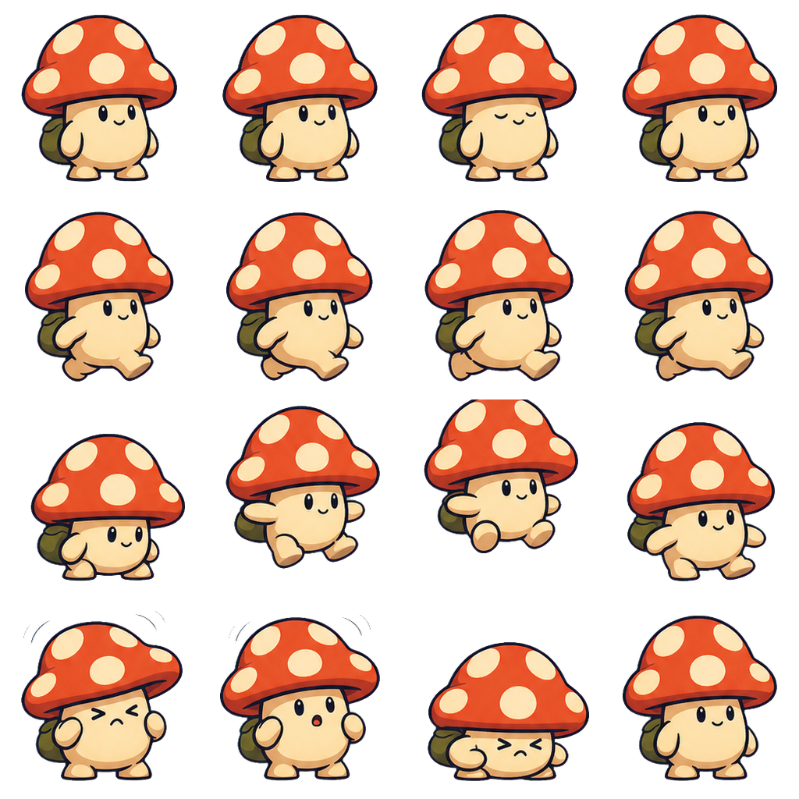
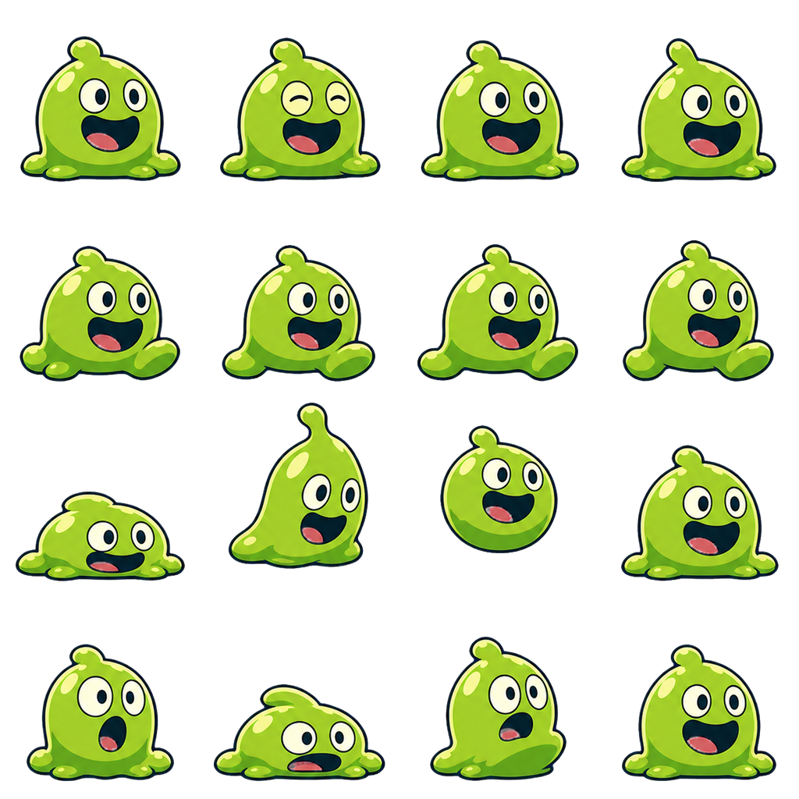
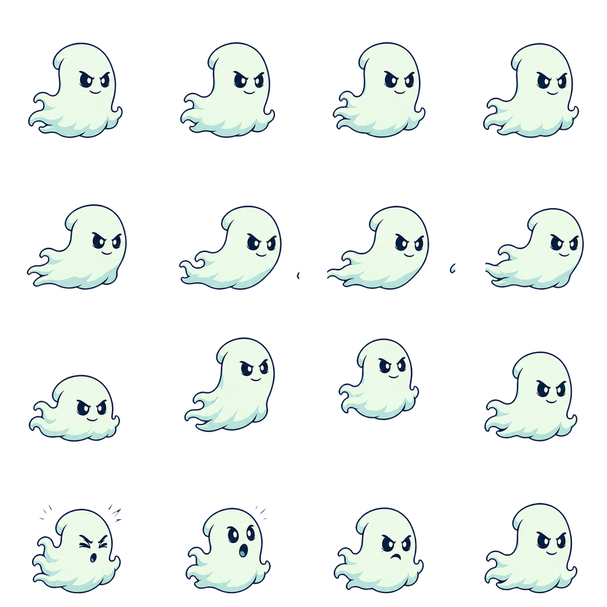

# Projekt Abriss

[Spielbare GitHub-Pages-Version](https://emfau88.github.io/abriss/)

Arbeitstitel für ein browserbasiertes, rundenartig inszeniertes Auto-Artillery-Spiel über eine chaotische Crew unterschiedlicher Fantasy-Wesen.

Der Spieler führt eine Crew eigenwilliger Spezialisten. Er stellt Team, Ausrüstung und Verhaltensprioritäten zusammen, beobachtet nachvollziehbare autonome Entscheidungen und greift nur mit wenigen wertvollen Kommandos ein. Zerstörbares Terrain verändert dabei fortlaufend die taktische Lage.

## Projektstatus

Die Produktvision und der erste Vertical Slice sind festgelegt. Das interne 3-gegen-3-Match ist spielbar: Figuren laufen oder springen lokal, wählen zwischen Panzerfaust, zeitgezündeter Wurfgranate und Geländebrecher, verändern Terrain und werden von Explosionen zurückgeschleudert. Zwei Fullscreen-HD-Karten – Sonneninseln und ein humorvoller Space-Resort – sind im Hauptmenü wählbar. Sieben klar unterscheidbare Cartoon-Figuren stehen im normalen Match zur Auswahl; ihre reduzierten 4×4-Sheets priorisieren große Farbflächen, starke Konturen und stabile Animationen. Ein dünner Manager-Loop führt vom Hauptmenü über Auswahl von drei Wesen und deren Waffenpräferenzen ins Match und danach in einen humorvollen Einsatzbericht mit einer kleinen Freischaltung. „Lass das!“ und ein einmaliger Waffenbefehl bleiben die direkten Managerinterventionen im Match.

## Figuren im Spiel

<p align="center">
  
  
  
</p>

Die Sheets zeigen jeweils vier kontrollierte Frames für Idle, Laufen, Sprung und
Treffer. Dadurch bleiben Moki, GLIB und Ghost auch bei der kleinen Matchkamera
klar lesbar und ohne zusätzliche Render-Tweens ruhig. Weitere Kaderfiguren:
Pop Diva, Henne, RINGO und Hornling.

## Lokal starten

Voraussetzung ist Node.js `^20.19.0` oder `>=22.12.0`.

```bash
npm install
npm run dev
```

Qualitätsprüfungen:

```bash
npm run typecheck
npm test
npm run build
```

Der Produktionsbuild verwendet relative Assetpfade und kann deshalb sowohl an der Domainwurzel als auch unter einem GitHub-Pages-Projektpfad ausgeliefert werden.

## GitHub Pages

Jeder Push auf `main` prüft Tests und Produktionsbuild und veröffentlicht anschließend `dist/` über GitHub Actions. Im Repository muss unter **Settings → Pages → Build and deployment** einmalig **GitHub Actions** als Quelle ausgewählt sein.

Die Spielhülle passt das feste 16:9-Sichtfenster an Desktop, mobiles Querformat und mobiles Hochformat an. Auf unterstützten Touch-Browsern erscheint ein Vollbildschalter. Im Hochformat bleibt das gesamte Spiel sichtbar; wegen der HUD-Lesbarkeit wird Querformat empfohlen.

Aktueller spielbarer Ablauf:

- `Einsatz planen`: drei aus sieben Wesen wählen, Waffenpräferenzen setzen und nach dem Match den Bericht öffnen,
- `Schnelles Testmatch`: Manager-Ebene für die Entwicklung überspringen,
- `P`: Persönlichkeit wechseln,
- `D`: alle bewerteten Kandidaten anzeigen,
- `X`: den aktuellen Plan genau einmal ablehnen,
- `1` / `2` / `3`: einmal pro Match Rakete, Granate oder Geländebrecher für den nächsten Plan vorgeben,
- `Leertaste`: den angekündigten Plan ausführen,
- `R`: Szene mit demselben Seed neu starten,
- `Pfeiltasten`: Kamera schwenken,
- `Q` / `E` oder Mausrad: Kamera zoomen,
- `1 Finger`: Kamera auf Touch-Geräten schwenken,
- `2 Finger`: um den Gestenmittelpunkt zoomen,
- `O`: Weltübersicht,
- `C`: sanfte Kamerafahrten oder direkte Schnitte.
- `H`: kompakte Hilfe ein-/ausblenden.

## Einstieg

Für Menschen:

1. [Projektindex](docs/00_PROJECT_INDEX.md)
2. [Produktvision](docs/01_PRODUCT_VISION.md)
3. [Vertical Slice](docs/04_VERTICAL_SLICE.md)
4. [Roadmap](docs/05_ROADMAP.md)

Für Coding-Agenten:

1. [AGENTS.md](AGENTS.md)
2. die zu bearbeitende Datei unter `tasks/`
3. alle dort als Pflichtlektüre genannten Dokumente

## Verbindliche Leitidee

> Ein fröhlicher Auto-Artillery-Teammanager, in dem der Spieler die vorhersehbar unvorhersehbaren Aktionen einer liebenswert inkompetenten Crew verschiedener Fantasy-Wesen vorbereitet, versteht und mit wenigen Kommandos beeinflusst.

Der Kern muss bereits mit Platzhaltergrafik tragen. Umfangreiche Meta-Systeme, finale Assets und große Inhaltsmengen folgen erst, wenn der Vertical Slice nachweislich verständlich und unterhaltsam ist.
