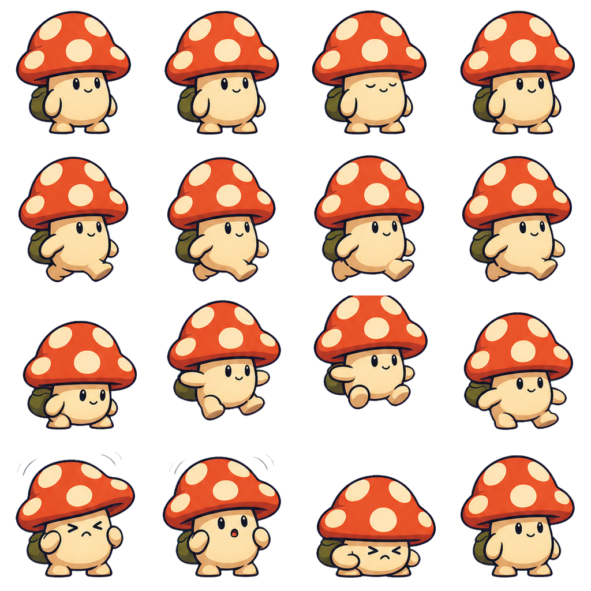
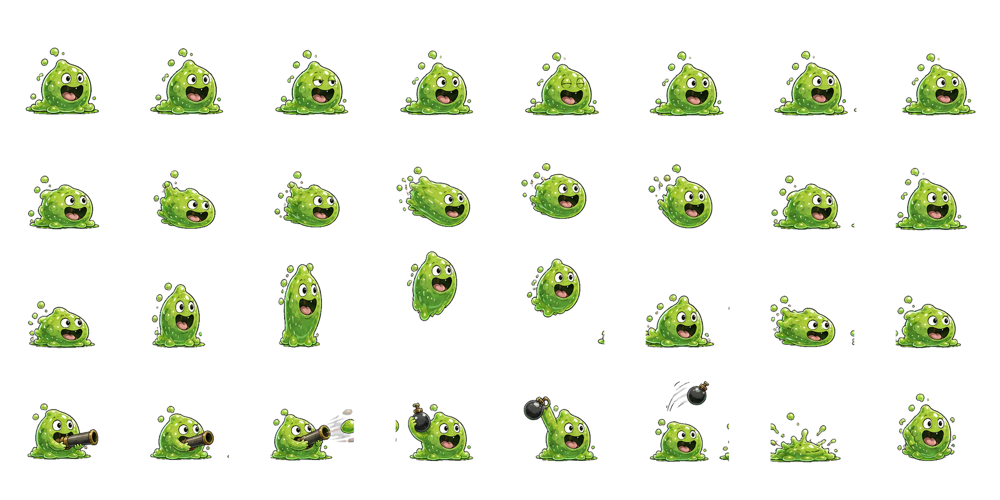
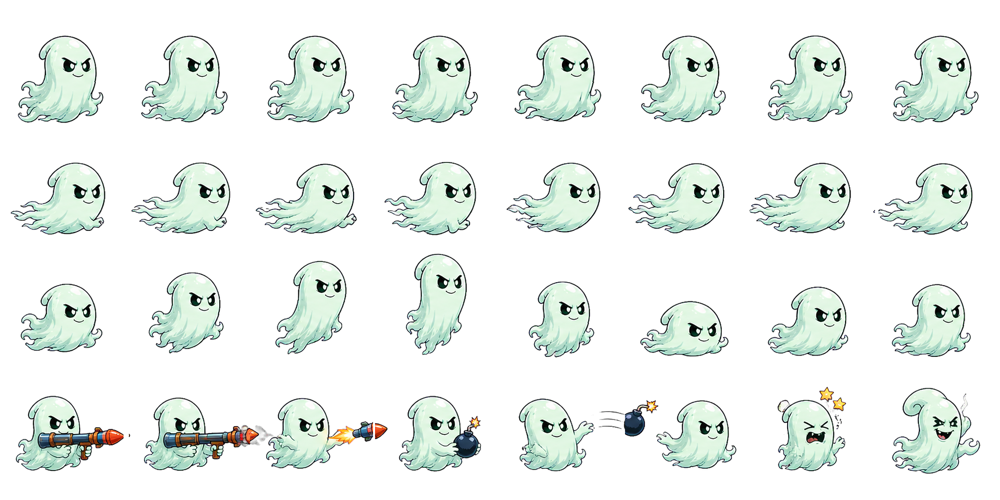

# Zwei getrennte Spielprototypen

Dieses Repository teilt TypeScript-, Phaser-, Test- und Pages-Infrastruktur,
enthält aber **zwei vollständig getrennte Spielprodukte**. Sie teilen weder
Gameplaycode noch Produktentscheidung und sind über getrennte URLs spielbar.

| Produkt | Worum es geht | Spielen |
| --- | --- | --- |
| **Projekt Abriss** | rundenartiger Auto-Artillery-Teammanager mit autonomen Fantasy-Figuren | [Abriss starten](https://emfau88.github.io/abriss/) |
| **Burrow-Labor** | direkt gesteuerter Mobile-First-Grab- und Untergraben-Prototyp | [Burrow starten](https://emfau88.github.io/abriss/burrow.html) |

> **Wichtig:** Burrow ist kein Ersatz oder Umbau von Abriss. Ein automatisierter
> Isolationstest verhindert versehentliche Abriss-Gameplayimporte in Burrow.

## Projekt Abriss

Arbeitstitel für ein browserbasiertes, rundenartig inszeniertes Auto-Artillery-Spiel über eine chaotische Crew unterschiedlicher Fantasy-Wesen.

Der Spieler führt eine Crew eigenwilliger Spezialisten. Er stellt Team, Ausrüstung und Verhaltensprioritäten zusammen, beobachtet nachvollziehbare autonome Entscheidungen und greift nur mit wenigen wertvollen Kommandos ein. Zerstörbares Terrain verändert dabei fortlaufend die taktische Lage.

## Projektstatus

Die Produktvision und der erste Vertical Slice sind festgelegt. Das interne 3-gegen-3-Match ist spielbar: Figuren laufen oder springen lokal, wählen zwischen Panzerfaust, zeitgezündeter Wurfgranate und Geländebrecher, verändern Terrain und werden von Explosionen zurückgeschleudert. Zwei Fullscreen-HD-Karten – Sonneninseln und ein humorvoller Space-Resort – sind im Hauptmenü wählbar. Sieben klar unterscheidbare Cartoon-Figuren stehen im normalen Match zur Auswahl; ihre reduzierten 4×4-Sheets priorisieren große Farbflächen, starke Konturen und stabile Animationen. Ein dünner Manager-Loop führt vom Hauptmenü über Auswahl von drei Wesen und deren Waffenpräferenzen ins Match und danach in einen humorvollen Einsatzbericht mit einer kleinen Freischaltung. „Lass das!“ verwirft eine ganze sichtbare Planfamilie statt nur eines minimal anderen Bogens; der einmalige Waffenbefehl bleibt die zweite direkte Managerintervention.

Für den Kernloop-Vergleich schaltet das Hauptmenü zwischen **Auto**,
**Zielauftrag** und **Direkt** um. Beim Zielauftrag wählt der Spieler pro
Crewzug nur den Rivalen; Figur und KI bestimmen weiterhin Position, Waffe,
Flugbahn und Streuung. Im direkten Modus wird innerhalb des 190-Punkte-Budgets
ein beliebiger erreichbarer Bodenpunkt samt Lauf-/Sprungvorschau gewählt;
anschließend bestimmt der Spieler Winkel, Kraft und Waffe. Das kurze
`KERNLOOP-TEST · KONFLIKTZONE` stellt riskante Ziele und ein Fasscluster für
den A/B/C-Vergleich bereit. Der isolierte `ACTIONMAP-TEST` erprobt daneben eine
Schild–Wagen–Triebwerk-Kettenreaktion, ohne den regulären Matchstand zu verändern.

## Figuren im Spiel

<p align="center">
  
  
  
</p>

Alle sieben Kaderfiguren verwenden denselben reduzierten 4×4-Standard: jeweils
vier kontrollierte Frames für Idle, Laufen, Sprung und Treffer. Große
Farbflächen, klare Konturen, eine stabile Fußlinie und der Verzicht auf
kosmetische Dauertweens halten sie auch bei kleiner Matchkamera lesbar.

## Lokal starten

Voraussetzung ist Node.js `^20.19.0` oder `>=22.12.0`.

```bash
npm install
npm run dev
```

Qualitätsprüfungen:

```bash
npm run typecheck
npm test
npm run build
npm run simulate
```

Der Produktionsbuild verwendet relative Assetpfade und kann deshalb sowohl an der Domainwurzel als auch unter einem GitHub-Pages-Projektpfad ausgeliefert werden.

## GitHub Pages

Jeder Push auf `main` prüft Tests und Produktionsbuild und veröffentlicht anschließend `dist/` über GitHub Actions. Im Repository muss unter **Settings → Pages → Build and deployment** einmalig **GitHub Actions** als Quelle ausgewählt sein.

Die Spielhülle passt das feste 16:9-Sichtfenster an Desktop, mobiles Querformat und mobiles Hochformat an. Auf unterstützten Touch-Browsern erscheint ein Vollbildschalter. Im Hochformat bleibt das gesamte Spiel sichtbar; wegen der HUD-Lesbarkeit wird Querformat empfohlen.

Aktueller spielbarer Ablauf:

- `Einsatz planen`: drei aus sieben Wesen wählen, Waffenpräferenzen setzen und nach dem Match den Bericht öffnen,
- `Schnelles Testmatch`: Manager-Ebene für die Entwicklung überspringen,
- `AUTO / ZIELAUFTRAG / DIREKT`: Autonomie, delegiertes Ziel und vollständige
  Eigensteuerung im selben Build vergleichen,
- `KERNLOOP-TEST · KONFLIKTZONE`: kurzes Validierungsmatch mit engem
  Teamrisiko und Fasscluster starten,
- `ACTIONMAP-TEST`: kuratierte Schild–Wagen–Triebwerk-Kette ausprobieren,
- im direkten Bewegungsabschnitt: erreichbares Gelände frei anklicken/antippen; Türkis zeigt Laufen, Gelb Springen,
- im direkten Zielabschnitt: von der Figur wegziehen und zum Schuss loslassen; Waffe über `1` / `2` / `3` oder HUD wählen,
- `P`: Persönlichkeit wechseln,
- `D`: alle bewerteten Kandidaten anzeigen,
- `X`: die aktuelle semantische Planfamilie genau einmal ablehnen,
- `1` / `2` / `3`: einmal pro Match Rakete, Granate oder Geländebrecher für den nächsten Plan vorgeben,
- `Leertaste`: den angekündigten Plan ausführen,
- `R`: Szene mit demselben Seed neu starten,
- `Pfeiltasten`: Kamera schwenken,
- `Q` / `E` oder Mausrad: Kamera zoomen,
- `1 Finger`: Kamera auf Touch-Geräten schwenken,
- `2 Finger`: um den Gestenmittelpunkt zoomen,
- `O`: Weltübersicht,
- `C`: sanfte Kamerafahrten oder direkte Schnitte.
- `H`: kompakte Hilfe ein-/ausblenden.

Der nächste Produktentscheid erfolgt nicht aus Bauchgefühl oder einem weiteren
internen Tuning, sondern über das [externe A/B/C-Playtest-Protokoll](docs/08_PLAYTEST_PROTOCOL.md).

## Burrow-Labor – separat von Projekt Abriss

[Burrow Gate 3 direkt starten](https://emfau88.github.io/abriss/burrow.html)

Burrow ist ein technisch und inhaltlich isolierter Mobile-First-Test innerhalb
desselben Repositories. Er verwendet ausschließlich `burrow.html`,
`src/burrow/`, `public/burrow/` und `docs/burrow/`; Abriss verwendet weiterhin
`index.html` und seine eigenen Module. Gemeinsam sind nur Build, Tests und
Hosting.

Aktueller Teststand:

- Gate 1: direktes Graben, Tunnelgleiten, Burst, Oberflächendurchbruch und
  Wiedereintauchen – persönlich positiv bewertet,
- Gate 2: Kutsche, automatische Bites, HP, Devour und Biomasse; Burst-Puffer,
  Stopp bei losgelassener Richtung sowie breitere Jagdroute technisch geprüft,
- Gate 3: einzelne Stützenhütte; zwei untergrabene Terrainanker führen zu
  einem sichtbaren Kollaps in einer moderat größeren 2.560×1.280-Arena,
- Mobile-Politur: die Phaser-Fläche füllt im Querformat den verfügbaren
  Viewport ohne seitliche Letterbox-Balken. Ein Vollbildschalter erscheint auf
  Touch-Geräten, wenn der Browser die Fullscreen-API freigibt.

### Offene Produktfrage: dauerhafte Tunnel und Spielfeldschwerpunkt

Der aktuelle Test hat eine wichtige, noch **unentschiedene** Designfrage
sichtbar gemacht: Das Monster braucht Erde nicht nur als zerstörbares
Hindernis, sondern als kontrollierbares Bewegungsmedium. Werden wiederholt
benutzte Tunnel zu breit, behandelt der bisherige Prototyp den leeren Raum zu
leicht wie eine Flugphase; dadurch verlieren Kurven, Distanz und erneute
Oberflächenangriffe an Präzision. Dauerhafte Zerstörung darf normales Spielen
nicht in eine selbst erzeugte Sackgasse verwandeln.

Eine zu prüfende Alternative ist deshalb ein überwiegend unterirdischer
Kernloop: belebte Höhlen, unterirdische Siedlungen und Wesen wären die
regelmäßigen Ziele; spektakuläre Oberflächendurchbrüche blieben seltene,
frei gewählte Höhepunkte. Das wäre **keine beschlossene Richtungsänderung**.
Vor weiterem Content wird geprüft, ob breite unterirdische Hohlräume einen
eigenen, präzisen Kavernenmodus erhalten sollen, während ausschließlich
tatsächliche Oberfläche Flugphysik verwendet.

Der aktuelle Höhlenschrein ist ebenfalls als Präsentationsproblem markiert:
Er braucht bei einer Wiederaufnahme eine natürlich verankerte Fundkammer
statt einer leeren, schwebenden Dekoration.

Steuerung:

- Desktop: `WASD` oder Pfeiltasten gedrückt halten für einen direkten, schnellen
  Kurswechsel; beim Loslassen hält der Wurm unter Erde an. `Shift` oder
  `Leertaste` löst Burst aus,
- Touch: links den gewünschten Kurs halten; beim Loslassen zentriert sich der
  Stick und der Wurm stoppt. Rechts `BURST` antippen; auf unterstützten
  Geräten steht oberhalb davon `Vollbild` bereit,
- `R`: Testarena zurücksetzen.

Produktregeln, Entscheidungstore und technische Grenzen stehen unter
[docs/burrow/](docs/burrow/). Der Burrow-Test ist bewusst noch keine
Open-World- oder Produktionsasset-Version.

## Einstieg

Für Menschen:

1. [Projektindex](docs/00_PROJECT_INDEX.md)
2. [Produktvision](docs/01_PRODUCT_VISION.md)
3. [Vertical Slice](docs/04_VERTICAL_SLICE.md)
4. [Roadmap](docs/05_ROADMAP.md)

Für Coding-Agenten:

1. [AGENTS.md](AGENTS.md)
2. die zu bearbeitende Datei unter `tasks/`
3. alle dort als Pflichtlektüre genannten Dokumente

## Verbindliche Leitidee

> Ein fröhlicher Auto-Artillery-Teammanager, in dem der Spieler die vorhersehbar unvorhersehbaren Aktionen einer liebenswert inkompetenten Crew verschiedener Fantasy-Wesen vorbereitet, versteht und mit wenigen Kommandos beeinflusst.

Der Kern muss bereits mit Platzhaltergrafik tragen. Umfangreiche Meta-Systeme, finale Assets und große Inhaltsmengen folgen erst, wenn der Vertical Slice nachweislich verständlich und unterhaltsam ist.
